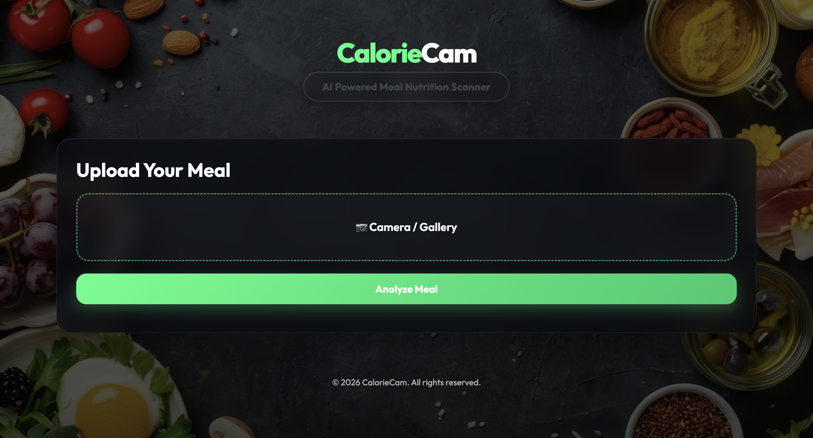
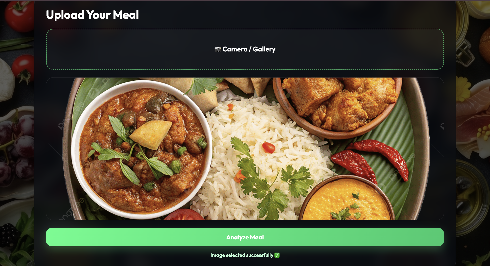
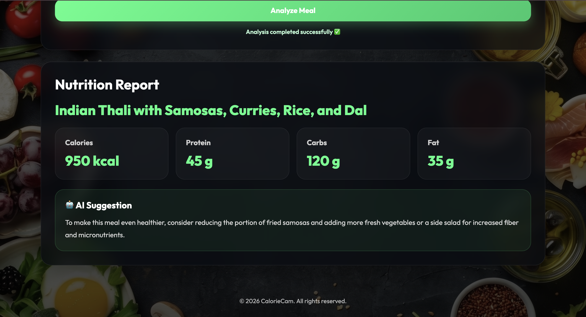

# <div align="center">📸 CalorieCam</div>

<div align="center">

### ⚡ AI Powered Meal Nutrition Scanner


<br><br>

[](calorie-cam-three.vercel.app)

</div>

---

## 🌟 About Project

**CalorieCam** is an AI-powered smart nutrition scanner that lets users upload meal images and instantly receive estimated:

✅ Calories  
✅ Protein  
✅ Carbohydrates  
✅ Fat  
✅ Healthy Suggestions  

Built using **Gemini AI + Vite + JavaScript** with a modern glassmorphism UI.

---

## 🚀 Features

✨ Upload meal image via Camera / Gallery  
✨ AI detects food items from image  
✨ Nutrition analysis in seconds  
✨ Smart healthy improvement suggestions  
✨ Beautiful responsive UI  
✨ Secure `.env` API integration  
✨ Fast deployment with Vercel

---

## 🛠️ Tech Stack

<div align="center">


</div>

---

## 📷 Screenshots

### 🏠 Home Screen



### 📤 Upload Meal



### 📊 Nutrition Result



---

## ⚙️ Run Locally

```bash
git clone YOUR_REPO_LINK
cd CalorieCam
npm install
npm run dev